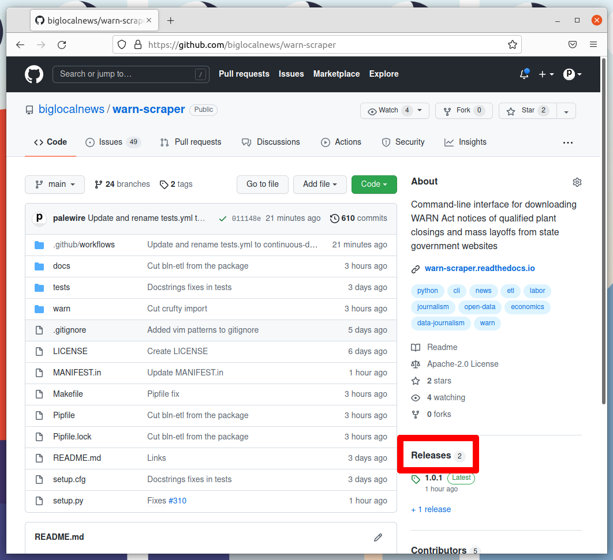
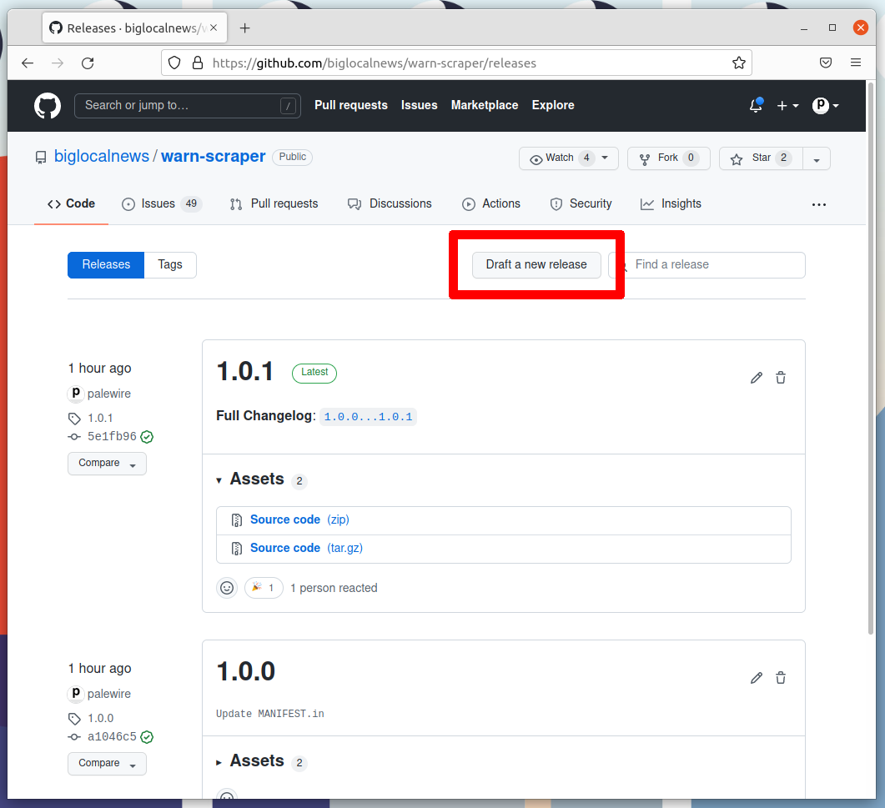
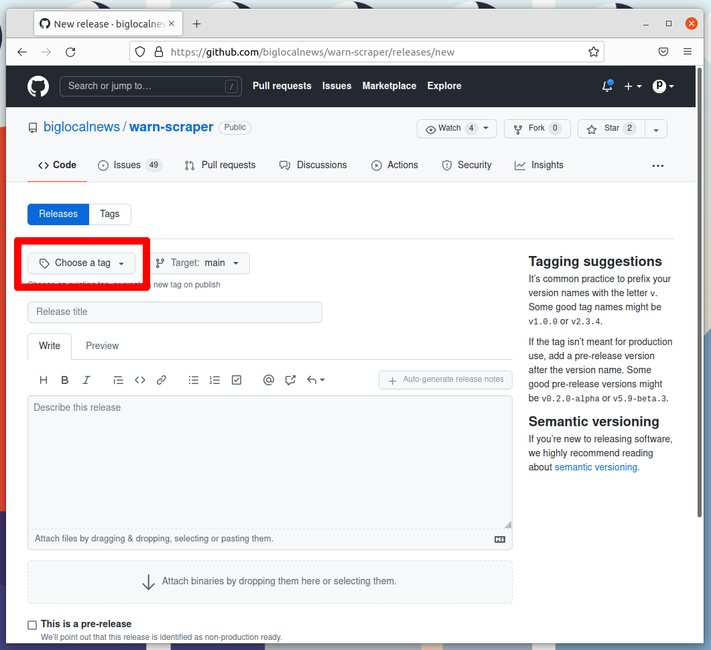
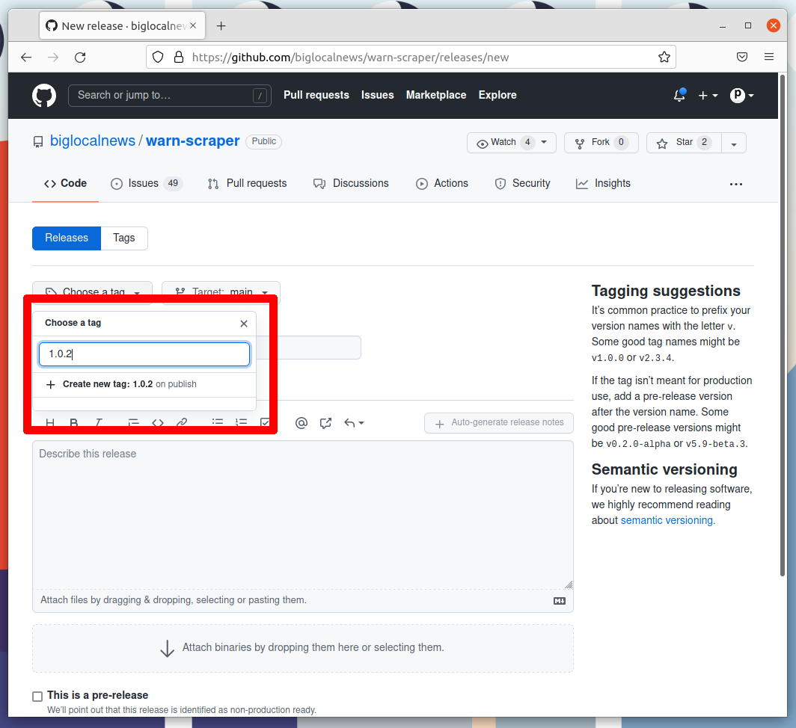
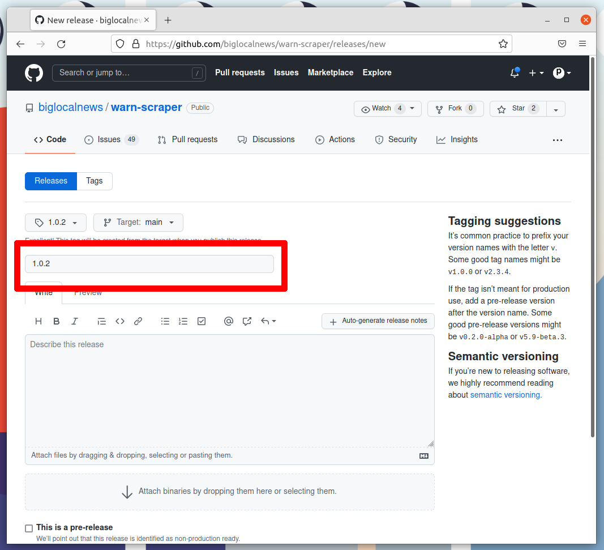
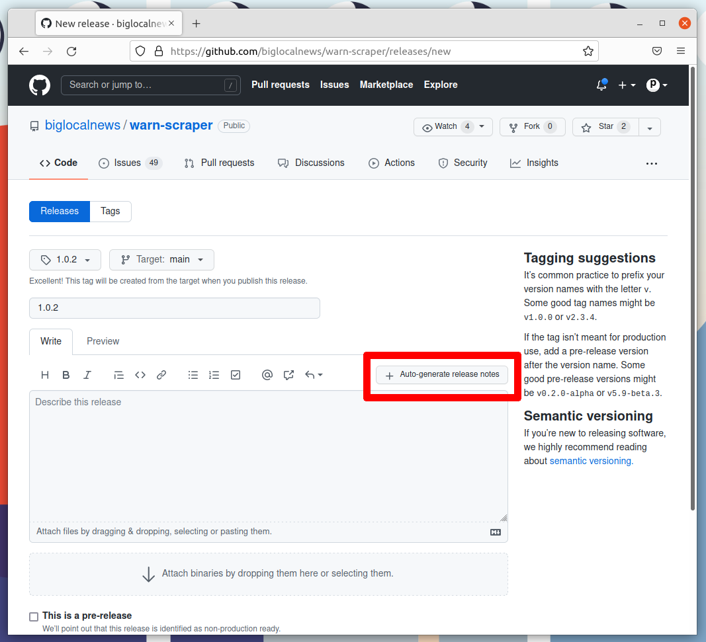
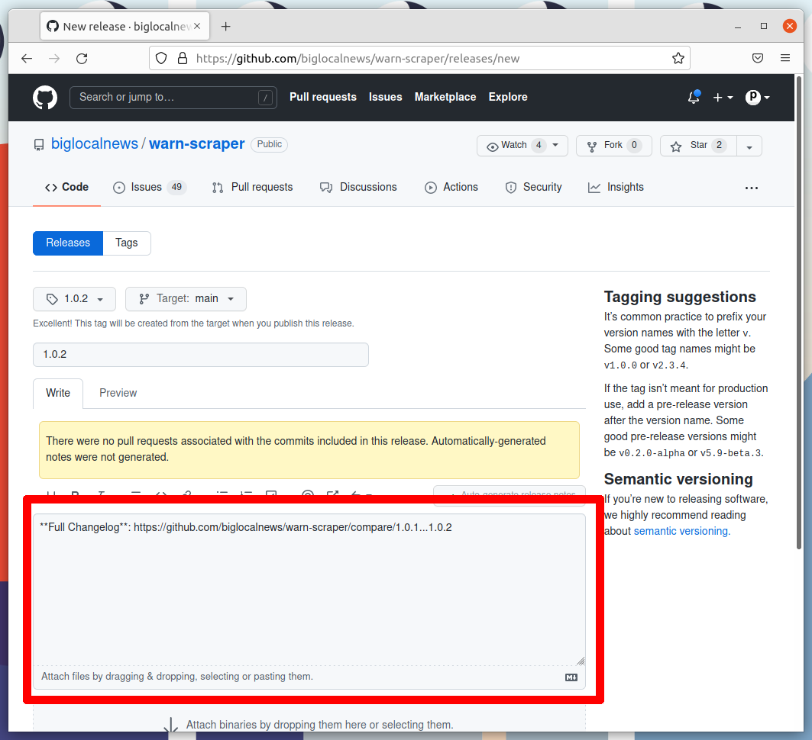
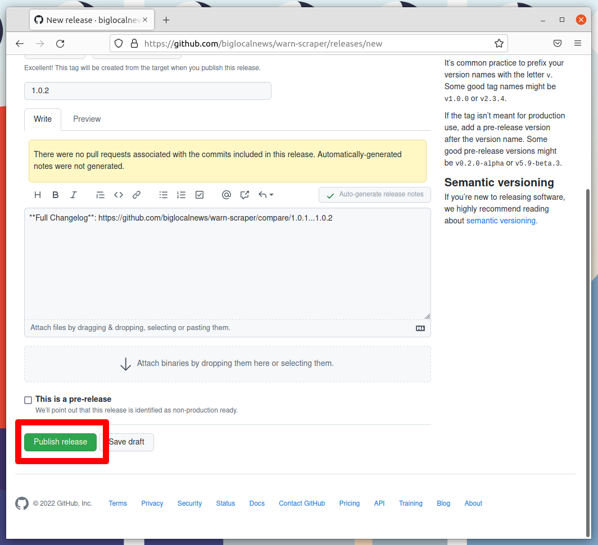
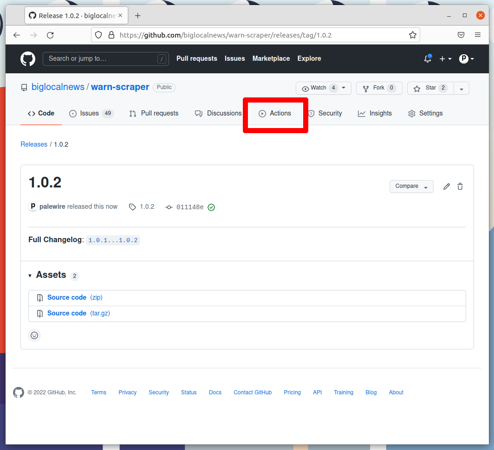
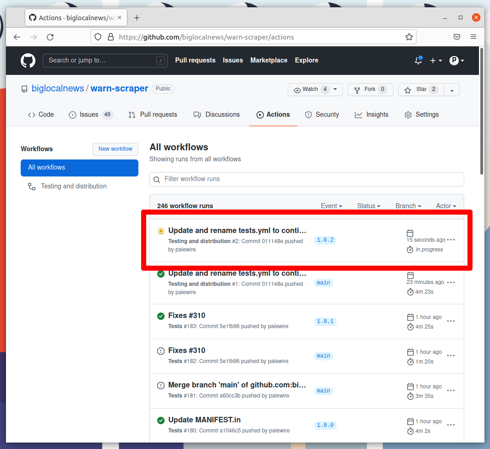

A template for [Prefect](prefect.io) [flows](https://docs.prefect.io/orchestration/flow_config/overview.html)

## How it works

This repository contains all the fundamentals needed to develop and deploy a Python routine that runs within Prefect’s cloud pipelines.

It contains:

* 🌊 A `flow.py` file with an example function that’s ready to run
* 🚧 A local development configuration that can run independently
* ☁️ A cloud production configuration for a Google Kubernetes Engine executor with Docker storage
* 📈 Easy vertical scaling of production workers via Dask
* 🧪 Unit tests via pytest
* 🚢 Automated deployment via GitHub releases and actions

The repository does not include the necessary configuration of a [Prefect Agent](https://docs.prefect.io/orchestration/agents/overview.html) to orchestrate flow runs.

## Getting started

Install [docker](https://docs.docker.com/get-docker/) and [docker-compose](https://docs.docker.com/compose/install/).

Create a new repository using this template. Clone your repository and move into the directory on your terminal.

Install our Python dependencies.

```bash
pipenv install --dev
```

Install pre-commit to run a battery of automatic quick fixes against your work.

```bash
pipenv run pre-commit install
```

Set the `PREFECT_FLOW_ENV` environment variable to 'development'. You can do this with an `export` command but if you're using `pipenv` I recommend you add it to [an .env file](https://pipenv.pypa.io/en/latest/advanced/#automatic-loading-of-env) at the root of your project.

```bash
echo 'PREFECT_FLOW_ENV=development' > .env
```

Tell Prefect to run a local server on your computer.

```bash
pipenv run prefect backend server
```

Start the local server.

```bash
pipenv run prefect server start
```

Open a new terminal, move into your code directory and create a local version of our Prefect project on your local machine.

```sh
pipenv run prefect create project 'Your Prefect Project'
```

To make changes to the process, edit `flow.py`. Then send your updates to the server with the line below. If you customize the name of the Prefect flow, edit it below to match.

```bash
pipenv run prefect register --project 'Your Prefect Project' -p ./flow.py
```

Start an agent in the background to run your tasks.

```bash
pipenv run prefect agent local start --no-hostname-label --label etl
```

Navigate to `http://localhost:8080` to run flows and see the results.

Future changes to the flow will need to registered with the local server, as before:

```bash
pipenv run prefect register --project 'Your Prefect Project' -p ./flow.py
```

## Deployment

Shipping your code to the production environment preferred by this template requires a few introductory steps.

First you must install Google Cloud’s [gcloud](https://cloud.google.com/sdk/docs/install) command line tool and successfully use it to log into an account with the hosting service.

If you don't have one already, use it to create a [Workload Identity Federation](https://cloud.google.com/iam/docs/workload-identity-federation) that will allow your GitHub Action to log in to your Google Cloud account. The instructions below are cribbed from the documentation for the [google-github-actions/auth](https://github.com/google-github-actions/auth#setting-up-workload-identity-federation) Action. Follow along in your terminal.

The first command creates a [service account](https://cloud.google.com/iam/docs/service-accounts) with Google. I will save the name I make up, as well as my Google project id, as environment variables for reuse. You should adapt the variables here, and others as we continue, to fit your project and preferred naming conventions.

```bash
export PROJECT_ID=my-project-id
export SERVICE_ACCOUNT=my-service-account
gcloud iam service-accounts create "${SERVICE_ACCOUNT}" \
  --project "${PROJECT_ID}"
```

Enable Google's IAM API for use.

```bash
gcloud services enable iamcredentials.googleapis.com \
  --project "${PROJECT_ID}"
``` 

Create a workload identity pool that will manage that will manage the GitHub Action's roles in Google Cloud's permission system.

```
export WORKLOAD_IDENTITY_POOL=my-pool
gcloud iam workload-identity-pools create "${WORKLOAD_IDENTITY_POOL}" \
  --project="${PROJECT_ID}" \
  --location="global" \
  --display-name="${WORKLOAD_IDENTITY_POOL}"
```

Get the unique identifier of that pool.

```bash
gcloud iam workload-identity-pools describe "${WORKLOAD_IDENTITY_POOL}" \
  --project="${PROJECT_ID}" \
  --location="global" \
  --format="value(name)"
```

Export the returned value to a new variable.

```bash
export WORKLOAD_IDENTITY_POOL_ID=whatever-you-got-back
```

Create a provider within the pool for GitHub to access.

```bash
export WORKLOAD_PROVIDER=my-provider
gcloud iam workload-identity-pools providers create-oidc "${WORKLOAD_PROVIDER}" \
  --project="${PROJECT_ID}" \
  --location="global" \
  --workload-identity-pool="${WORKLOAD_IDENTITY_POOL}" \
  --display-name="${WORKLOAD_PROVIDER}" \
  --attribute-mapping="google.subject=assertion.sub,attribute.actor=assertion.actor,attribute.repository=assertion.repository" \
  --issuer-uri="https://token.actions.githubusercontent.com"
```

Allow a GitHub Action based in your repository to login to the service account via the provider.

```bash
export REPO=my-username/my-repo

gcloud iam service-accounts add-iam-policy-binding "${SERVICE_ACCOUNT}@${PROJECT_ID}.iam.gserviceaccount.com" \
  --project="${PROJECT_ID}" \
  --role="roles/iam.workloadIdentityUser" \
  --member="principalSet://iam.googleapis.com/${WORKLOAD_IDENTITY_POOL_ID}/attribute.repository/${REPO}"
```

Ask Google to return the identifier of that provider.

```bash
gcloud iam workload-identity-pools providers describe "${WORKLOAD_PROVIDER}" \
  --project="${PROJECT_ID}" \
  --location="global" \
  --workload-identity-pool="${WORKLOAD_IDENTITY_POOL}" \
  --format="value(name)"
```

That will return a string that you should save for later. We'll use it in our GitHub Action.

Finally, we need to make sure that the service account we created at the start has permission to muck around with Google Artifact Registry.

```bash
gcloud projects add-iam-policy-binding $PROJECT_ID \
    --member="serviceAccount:${SERVICE_ACCOUNT}@${PROJECT_ID}.iam.gserviceaccount.com" \
    --role="roles/artifactregistry.admin"
```

To verify that worked, you can ask Google print out the permissions assigned to the service account.

```
gcloud projects get-iam-policy $PROJECT_ID \
    --flatten="bindings[].members" \
    --format='table(bindings.role)' \
    --filter="bindings.members:${SERVICE_ACCOUNT}@${PROJECT_ID}.iam.gserviceaccount.com"
```

* Create a Google Artifact Registry repository for a Docker image
* Spin up a Prefect agent to orchestrate your flows
* Create an API key at Prefect.io

These steps are arcane. They will be frustrating. But you will likely only have to do them once.

While not included here, most of the steps are documented in the following blog posts by Big Local News.

* [How to push tagged Docker releases to Google Artifact Registry with a GitHub Action](https://gist.github.com/palewire/12c4b2b974ef735d22da7493cf7f4d37)
* [How to deploy a Prefect agent to Google Kubernetes Engine](https://gist.github.com/palewire/072513a9940478370697323c0d15c6ec)

Once all that is done, you'll want to set four secrets in your repository's settings. They will be used to deploy your code from GitHub into Google Cloud and Prefect.

* `PREFECT_API_KEY`: An API key created in your Prefect dashboard
* `PREFECT_PROJECT_NAME`: The name of your Prefect project
* `GCLOUD_WORKLOAD_IDENTITY_PROVIDER`: The name of the Workload Identity Provider created by Google
* `GCLOUD_SERVICE_ACCOUNT`: The name of the service account created by Google

You'll also need to edit the `get_storage` function in flow.py to include your Google Artifact Registry target. This is where the Docker image with your Python code will be shipped during a release.

```
"production": Docker(
    # An image containing the flow's code, as well as our Python dependencies,
    # will be compiled when `pipenv run prefect register` is run and then
    # uploaded to our repository on Google Artifact Registry.
    registry_url="your-registry-url",  # <-- Here's the docker registry where it will go
    image_name="your-google-artifact-registry-image-name", # <-- Here's the path within the registry to your image
    python_dependencies=[],  # <-- If you have any Python dependencies like `requests` you should add them here
),
```

With all that in hand, you should be ready to release.

## Releasing

OTheur release process is automated as a [continuous deployment](https://en.wikipedia.org/wiki/Continuous_deployment) via the [GitHub Actions](https://github.com/features/actions) framework. The logic that governs the process is stored [in the `workflows` directory](tree/.github/workflows/continuous-deployment.yml).

That means that everything necessary to make a release can be done with a few clicks on the GitHub website. All you need to do is make a tagged release at  then wait for the computers to handle the job.

Here's how it's done, step by step. The screenshots are from a different repository, but the process is the same.

### 1. Go to the releases page

The first step is to visit your repository's homepage and click on [the "releases" headline](./releases) in the right rail.



### 2. Click 'Draft a new release'

Note the number of the latest release. Click the "Draft a new release" button in the upper-right corner. If you don't see this button, you do not have permission to make a release. Only the maintainers of the repository are able to release new code.



### 3. Create a new tag

Think about how big your changes are and decide if you're a major, minor or patch release.

All version numbers should feature three numbers separated by the periods, like `1.0.1`. If you're making a major release that isn't backwards compatible, the latest release’s first number should go up by one. If you're making a minor release by adding a feature or major a large change, the second number should go up. If you're only fixing bugs or making small changes, the third number should go up.

If you're unsure, review the standards defined at [semver.org](https://semver.org) to help make a decision. In the end don't worry about it too much. Our version numbers don't need to be perfect. They just need to be three numbers separated by periods.

Once you've settled on the number for your new release, click on the "Choose a tag" pull down.



Enter your version number into the box. Then click the "Create new tag" option that appears.



### 4. Name the release

Enter the same number into the "Release title" box.



### 5. Auto-generate release notes

Click the "Auto-generate release notes" button in the upper right corner of the large description box.



That should fill in the box below. What appears will depend on how many pull requests you've merged since the last release.



### 6. Publish the release

Click the green button that says "Publish release" at the bottom of the page.



### 7. Wait for the Action to finish

GitHub will take you to a page dedicated to your new release and start an automated process that release our new version to the world. Follow its progress by clicking on the [Actions tab](./actions) near the top of the page.



That will take you to the Actions monitoring page. The task charged with publishing your release should be at the top.



And that's it. The action should have released a new version of our Docker image in the Google Artifact Registry and re-registered the flows with Prefect. You could debug this process via Google Cloud Console and the Prefect dashboard, but it shouldn't be necessary if everything works.

## About

The project is sponsored by [Big Local News](https://biglocalnews.org/#/about), a program at Stanford University that collects data for impactful journalism. The code is maintained by [Ben Welsh](https://palewi.re/who-is-ben-welsh/), a visiting data journalist from the Los Angeles Times.
